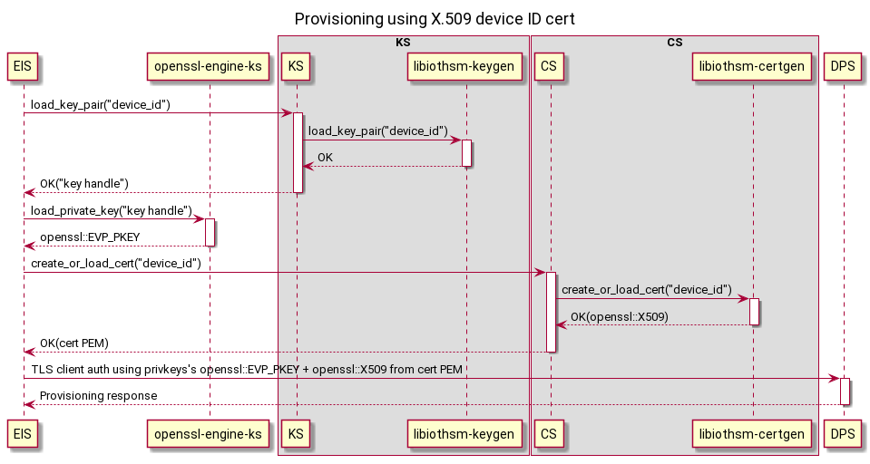
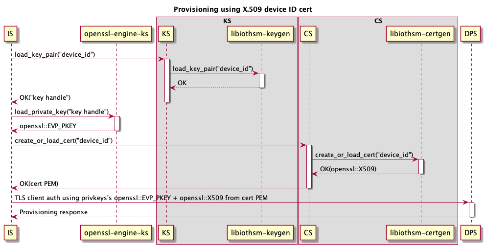
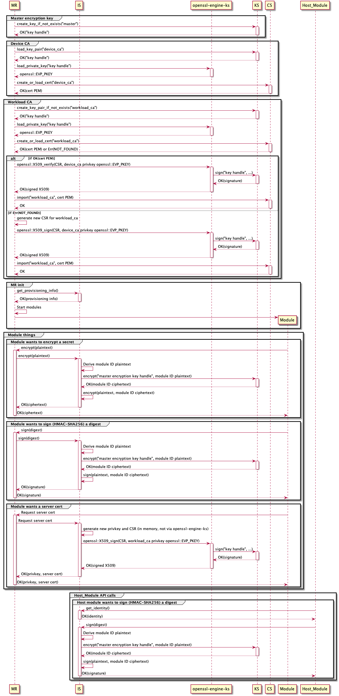

IoT Edge v2 is made up of several independent services instead of one monolithic `iotedged`

- Identity Service

    Handles provisioning.


- Keys Service

    Stores keys and allows callers to perform operations with those keys like encrypt, decrypt, sign.


- Certificates Service

    Stores certificates and allows callers to import and export them.


- Module Runtime

    Runs Edge modules, like `iotedged` today, though not necessarily specifically Docker containers.


Each component talks to the other components over RPC of some sort (TODO: HTTP-over-UDS? gRPC-over-UDS? D-Bus? Something else?)

The configuration / settings below are represented in YAML, but they will follow the settings file format for IS (i.e. TOML).

# Provisioning

## X.509 device ID cert

1. User preloads the device ID cert's privkey into their device's HSM and installs the PKCS#11 library to access it.

1. User configures KS to use PKCS#11 and preloads the device ID cert's privkey.

    ```yaml
    pkcs11_lib_path: '/usr/lib/softhsm.so'
    pkcs11_base_slot: 'pkcs11:slot-id=0?pin-value=1234'

    'preloaded_key:device-id': 'pkcs11:slot-id=0;object=device%20id?pin-value=1234'
    ```

1. User configures CS to preload the device ID cert.

    ```yaml
    homedir_path: '/var/lib/iotedge/cs'

    'preloaded_cert:device-id': '/var/secrets/device-id.cer'
    ```

1. User configures IS with provisioning info.

    ```yaml
    provisioning:
      source: 'dps'
      scope_id: '...'
      attestation:
        method: 'x509'
        # TODO: If we decide certs and keys *must* come from KS and CS, then the URI is redundant and it could directly be the respective IDs.
        # Otherwise using a URI allows the scheme to determine other options for the source, like file:// for files.
        identity_cert: 'cert://device-id'
        identity_pk: 'key://device-id'
    ```

1. User starts KS, CS, IS.

1. IS performs provisioning.

    
    


# Modules via module runtime for containers (similar to current iotedged)

(This assumes device CA + workload CA are being used. For DPS-as-a-CA mode, ignore the device CA steps.)

1. User preloads the device CA cert's privkey into their device's HSM.

1. User configures KS to preload the device CA cert's privkey.

    ```yaml
    'preloaded_key:device-ca': 'pkcs11:slot-id=0;object=device%20ca?pin-value=1234'
    ```

1. User configures CS to preload the device ID cert and trusted CA cert.

    ```yaml
    'preloaded_cert:device-ca': '/var/secrets/device-ca.cer'
    'preloaded_cert:trusted-ca': '/var/secrets/trusted-ca.cer'
    ```

1. User configures MR.

    ```yaml
    certificates:
      # TODO: Same point about URIs vs IDs as above applies here.
      device_ca_cert: 'cert://device-ca'
      device_ca_pk: 'key://device-ca'
      trusted_ca_certs: 'cert://trusted-ca'

    agent:
      name: 'edgeAgent'
      type: 'docker'
      config: {...}

    hostname: '...'

    connect:
      management_uri: 'unix:///var/lib/iotedge/mgmt.sock'
      workload_uri: 'unix:///var/lib/iotedge/workload.sock'

    listen:
      management_uri: 'unix:///var/lib/iotedge/mgmt.sock'
      workload_uri: 'unix:///var/lib/iotedge/workload.sock'

    homedir: '/var/lib/iotedge/iotedged'

    moby_runtime:
      uri: 'unix:///var/run/docker.sock'
    ```

1. User configures CS to preload the device ID cert.

    ```yaml
    homedir_path: '/var/lib/iotedge/cs'

    'preloaded_cert:device-id': '/var/secrets/device-id.cer'
    ```

1. User starts MR.

1. MR does its work.

    


# API surface

## MR

The iotedged REST APIs will preserve their spec, in order to remain backwards-compatible.


## IS

### Get IoT device provisioning result
`GET /identities/aziot/device`

#### Response (SAS case)
```json
{
  "id": "aziot://myhub.net/device/device01",
  "managedBy": "aziot://myhub.net/",
  "auth": {
    "type": "sas",
    "keystorehandle": "string",
  }
}
```
#### Response (X.509 case)
```json
{
  "id": "aziot://myhub.net/device/device01",
  "managedBy": "aziot://myhub.net/",
  "auth": {
    "type": "x509",
    "certstorehandle": "string",
  }
}
```

### Trigger IoT device reprovisioning flow
`GET /identities/aziot/device/reprovision`

#### Response
```
200 Ok
```

## KS

### Create Key
`POST /keystore/key`

#### Request
```json
{
  "keyid": "string",
}
```

#### Response
```json
{
  "keystorehandle": "string"
}
```

### Get Key
`GET /keystore/key`

#### Request
```json
{
  "keyid": "string",
}
```

#### Response
```json
{
  "keystorehandle": "string"
}
```

### Create Key Pair
`POST /keystore/keypair`

#### Request
```json
{
  "keypairid": "string",
}
```

#### Response
```json
{
  "keystorehandle": "string"
}
```

### Load Key Pair
`GET /keystore/keypair`

#### Request
```json
{
  "keypairid": "string",
}
```

#### Response
```json
{
  "keystorehandle": "string"
}
```


### Sign using Private Key
`POST /keystore/sign`

#### Request
```json
{
  "keystorehandle": "string",
  "algo": "HMACSHA256",
  "data": "string"
}
```

#### Response
```json
{
  "digest": "string"
}
```


## CS

### Create Cert
`POST /certstore/cert`

#### Request
```json
{
  "certid": "string",
}
```

#### Response
```json
{
  "pem": "string"
}
```

### Load Cert
`GET /certstore/cert`

#### Request
```json
{
  "certid": "string",
}
```

#### Response
```json
{
  "pem": "string"
}
```

### Import Cert
`GET /certstore/cert`

#### Request
```json
{
  "certid": "string",
  "pem": string
}
```

#### Response
```
200 Ok
```

